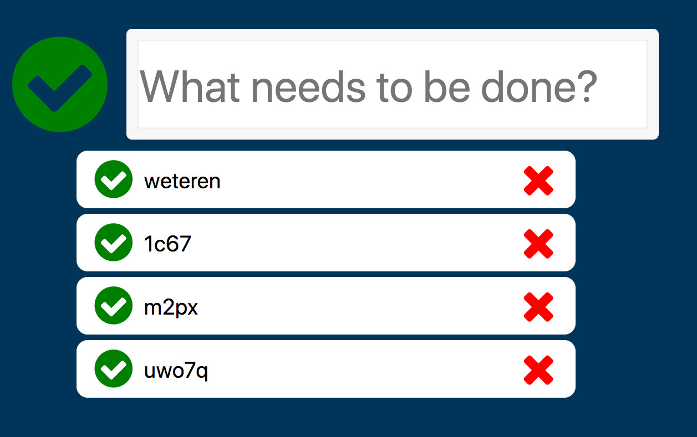

# restful-js

> `Starter Code` exercise for practice javascript RESTful API,objects, classes, methods and HTML5 events.

## Table of contents
* [General info](#general-info)
* [Screenshots](#screenshots)
* [Technologies](#technologies)
* [Setup](#setup)
* [Features](#features)
* [Status](#status)
* [Contact](#contact)

## General info
The purpose of the project is to refactor the previous project `practical-javascript` a TODO list webapp with basic functionality. [development-strategy.md](./development-strategy.md) file contains the steps used to complete this project, it describes the branches with details about the what is implemented.

## Screenshots

## Technologies
* HTML5
* CSS3
* git
* font-awesome library
* javascript
* json server

## Setup
You can clone or fork this repository and test the files.

## Features
The project features a web site with:
* Ability to add task to a TODO list
* Ability to modify a task from the TODO list
* Ability to delete a task from the TODO list
* Ability to mark tasks as completed from the TODO list
* Ability to toggle all tasks as completed or not completed
* font-awesome icon library to give a neat look
* All function use RESTful API calls with fetch

## Status
Project is: finished, final version.

## Contact
Created by [@ferrycosv](www.github.com/ferrycosv) - feel free to contact me!